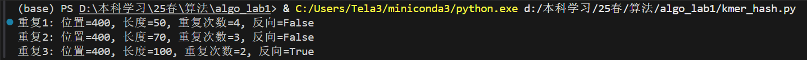

# Lab1 寻找样本DNA序列中的重复片段
姓名：季雨昊  
学号：23300240010

## 实验内容
输入两个DNA序列（reference，query）。寻找query中相对于reference中重复的子序列。输出重复子序列在reference中的位置，重复次数和是否发生逆转。

## 算法伪代码
```
FIND-REPEATS-KMER(ref, qry, max_len, min_len)
1. Initialize repeats as empty list
2. m ← length(qry)
3. covered ← array of m elements initialized to False
4. for k ← max_len downto min_len do
5.     if k > length(ref) or k > length(qry) then continue
6.     hash_table ← BUILD-KMER-HASH-TABLE(ref, k)  // O(nk) time
7.     j ← 0
8.     while j ≤ m - k do
9.         if covered[j] then
10.            j ← j + 1
11.            continue
12.        current_kmer ← qry[j..j+k-1]  // O(k) time
13.        if current_kmer ∈ hash_table then
14.            ref_pos ← hash_table[current_kmer]
15.            rev_comp ← REVERSE-COMPLEMENT(ref[ref_pos -k..ref_pos -1])
16.            is_reverse ← (current_kmer == rev_comp)
17.            repeat_count ← 1
18.            next_j ← j + k
19.            while next_j ≤ m -k do
20.                next_kmer ← qry[next_j..next_j+k-1]
21.                if next_kmer == current_kmer then
22.                    repeat_count ← repeat_count + 1
23.                    next_j ← next_j + k
24.                else break
25.            if repeat_count > 1 then
26.                for pos ← j to next_j -1 do covered[pos] ← True
27.                Append (ref_pos, k, repeat_count, is_reverse, j) to repeats
28.            j ← next_j
29.        else
30.            j ← j + 1
31. SORT repeats by start position (j)  // O(r log r) time
32. Adjust counts for overlapping repeats (e.g., subtract 1 if adjacent and conflicting)
33. Deduplicate repeats by (pos, length, is_reverse)
34. return unique repeats
```
```
BUILD-KMER-HASH-TABLE(S, k)
1. Initialize kmer_counts as empty dict
2. n ← length(S)
3. for i ← 0 to n - k do
4.     kmer ← S[i..i+k-1]
5.     rev_comp ← REVERSE-COMPLEMENT(kmer)
6.     if kmer ∉ kmer_counts then kmer_counts[kmer] ← i + k
7.     if rev_comp ∉ kmer_counts then kmer_counts[rev_comp] ← i + k
8. return kmer_counts
```
## 时空复杂度分析

### 时间复杂度的分析
1. **`build_kmer_hash_table`**：循环遍历整个reference链，执行n - k + 1次 ≈ O(n)次，每个单次循环需要提取反向序列，需要O(k)时间。总体时间复杂度为O(nk)。
2. **`find_repeats_kmer`**：
   - 外层循环从max_len到min_len，时间复杂度为O(max_len - min_len)。
   - 内层遍历query序列，时间复杂度为O(m)。
   - 每次遍历中调用`build_kmer_hash_table`，时间复杂度为O(nk)。
   - 快速排序的平均时间复杂度为O(r log r)，其中r是找到的重复序列的数量。
3. **总体时间复杂度**：O((max_len - min_len) * (nk + m) + r log r)。max_len和min_len可以视为常数，总的时间复杂度能被进一步化简为O(n + m + r log r)。

### 空间复杂度的分析
由三部分构成：哈希表、已检测序列的标记数组covered、重复序列结果记录列表repeats，空间复杂度为O(n + m + r)。

## 运算结果


## 代码仓库
https://github.com/LagunaKi/Fudan-Algorithm2025-lab1.git